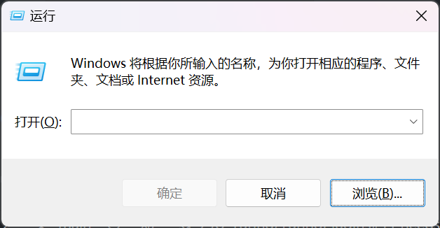

# 抛弃鼠标，拥抱键盘

## Win+R

> 当然对于 Mac 和 Linux 用户，好像不应该用 Win+R 来称呼我们接下来要说的事情。

在 Windows 系统，Win+R 呼出的对话框被称为 Run Dialog Box / Run Window，我们姑且将其翻译为 **“运行窗口”**。

<figure>

<!-- <figcaption> -->
<small>Run Window 界面</small>
<!-- <figcaption> -->
</figure>

正如界面所说，我们可以利用运行窗口打开相应的程序、文件夹、文档以及网络资源。可以这么理解：这其实就是一个小型终端，不过不具备路径切换、文件管理等等功能，只能用来运行文件，正如其名。

所以可以将想要打开的文件的路径存放在运行窗口下，常用的软件就那么几个，通过 Win+R 打开这些软件，可以为桌面省去很多快捷方式——从而打开一个软件不再需要点点点，只需要 Win+R，然后按上下方向键寻找记录并打开就行了（和终端查找自己的历史命令是一致的），这也是我“抛弃鼠标，拥抱键盘”的开始。

??? Tip "一点趣闻"
    笔者发现这一特点之后就把电脑桌面优化成几乎一个快捷方式都没有，只有一些需要用到但是不太常用的软件安排了快捷方式（当然，QQ、微信、游戏显然不在其列）。结果笔者的亲友拿到我的电脑时问的第一句话：
    
    你这电脑怎么什么都没有啊 $\odot\nabla\odot$

    我：
    {: style="height: 50px", class="light-img"}
    {: style="height: 50px", class="dark-img"}
    这样很酷不是吗（学计算机学的）

    然后帮TA把常见的应用程序的快捷方式都发送到桌面了，这样的魔↗术↘技↑巧↓还是自己玩玩得了（

还有一些点可以优化使用体验：由于文件的路径不是一成不变的，一旦一开始错误存放的软件被移到了其他路径，这个路径在运行窗口中就是无法使用的了。但因为你曾经成功打开了这个路径下的软件，而运行窗口中的路径无法被轻易删除（这个我们后面会提到），由于路径的唯一性，这个路径就成了一个废弃的路径，占用了你的运行窗口的历史记录里宝贵的空间（运行窗口的历史记录是有数量上限的），这不好。

而想要这种情况不发生就有两种方法：

- 第一种就是在运行窗口中删除这个路径。当然你先自行尝试会发现运行窗口本身不允许你进行这一操作，我们想要达成这一目的需要借助“注册表编辑器”（regedit）。在运行窗口输入`regedit`即可打开，然后在菜单栏下有路径，可以输入或者逐个点开文件夹至如下路径：

```plaintext
计算机\HKEY_CURRENT_USER\Software\Microsoft\Windows\CurrentVersion\Explorer\RunMRU
```

- 在这里删除路径即可（右键选项卡进行删除）。

---

- 第二种方法就是将常用的软件添加至**环境变量**。通俗的讲，环境变量就是告诉计算机某个路径（包括这个路径对应的文件夹或程序）在哪里的变量，以路径的形式存储在计算机中的特殊区域。对于 Windows，添加环境变量可以依照如下步骤：
    - 在运行窗口中输入`sysdm.cpl`可打开系统属性选项卡，点击菜单栏中的“高级”，可以看到右下角有环境变量的选项。
    - 点进去双击系统变量中的`Path`项，即可添加路径（文件的路径可以通过在任务管理器中右键该文件选择“复制文件路径”获得）。添加完成后需要重启以刷新环境变量。
- 添加完成后，即可直接输入文件名以调用程序。由于不管文件路径如何变，程序的名称一般不变，因此运行窗口的历史记录都是可以被使用的，只不过在文件路径改变之后，需要改变相应的环境变量以再次激活。

---

当然，运行窗口也可以用来打开网页，但是有用的网页太多，但运行窗口的记录空间太小，所以用运行窗口直接打开网页还是有点鸡肋的，不如存一个浏览器的环境变量然后运行浏览器，让有用的网页在收藏夹吃灰吧（